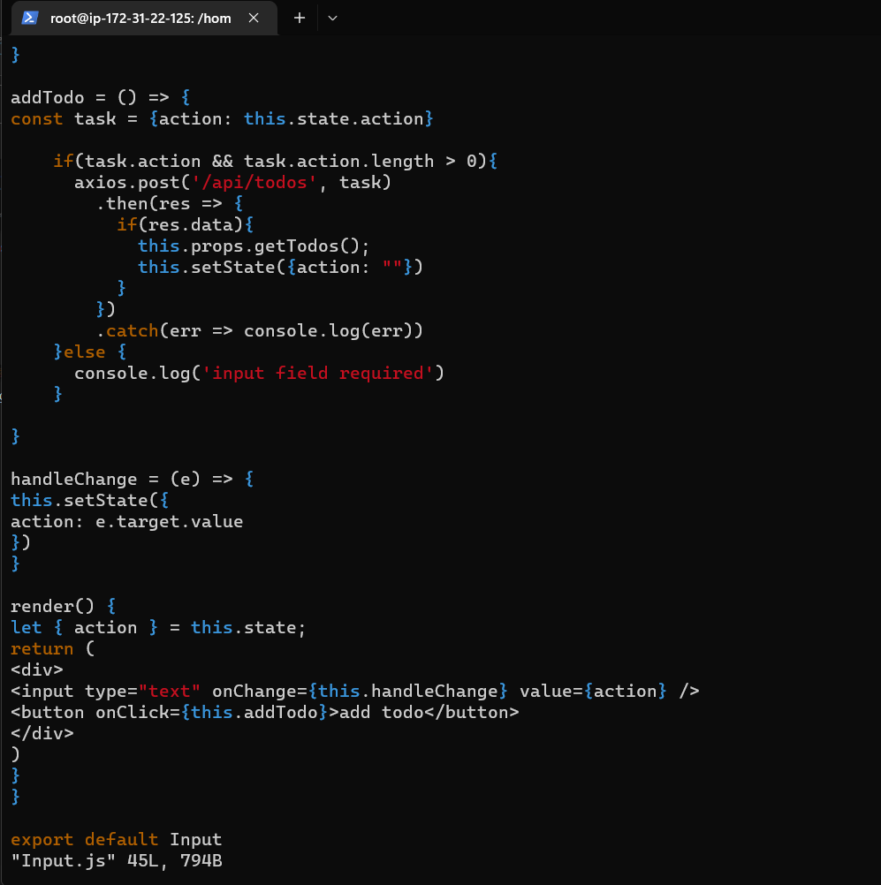

# Project 3 
## MERN STACK IMPLEMENTATION
### Backend Configuration - Update Ubuntu
* sudo apt update
* sudo apt upgrade
### Install Node.js on the server
* sudo apt-get install -y nodejs
### Check node.js version
* node -v

### Create a directory for To-Do project
* mkdir Todo
* ls
* cd Todo
### Initialise the project
*npm init

### Run ls to confirm we have package.json file
* ls

## INSTALL EXPRESSJS
### Install express using npm command
* npm install express
### Create a file index.js
* touch index.js
### Install *dotenv* module
* npm install dotenv
* vim index.js

* node index.js

## Routes
1. Create a new task
2. Display list of all tasks
3. Delete a completed task
### HTTP request methods: POST, GET, DELETE

* mkdir routes
* cd routes
* touch api.js
* vim api.js

## MODELS
* npm install mogoose
### Create a new models 
* mkdir models
* cd models
* touch todo.js
* vim todo.js

* vim api.js

## MONGODB DATABASE
### Create a Todo directory and name it .env
* touch .env
* vi .env

## Update *index.js* to reflect *.env* 
* vim index.js

### Start sever using command: 
* node index.js

## Install Postman

## FRONTEND CREATION
### cd into Todo directory and run the command:
* npm create-react-app client
* npm install concurrently --save-dev
## In *Todo* directory, open *package.jason* file

### configure proxy in *package.json*
* cd client
* vim package.json

* npm run dev

### Creating  React Components
* cd client
* cd src
* mkdir components
* cd components
* touch Input.js ListTodo.js Todo.js
* vi Input.js

* cd ..
* cd ..
### Install Axios
* npm install axios
* vim ListTodo.js

* vim *Todo.js*

* cd ..
* vim App.js

* vim App.css

* vim index.css

* cd ../..
* npm run dev 

